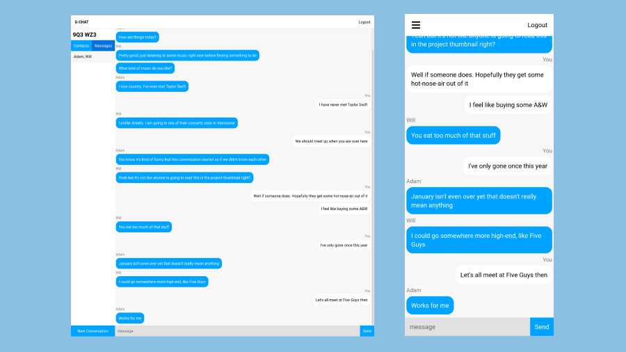

[![Contributors][contributors-shield]][contributors-url]
[![Forks][forks-shield]][forks-url]
[![Stargazers][stars-shield]][stars-url]
[![Issues][issues-shield]][issues-url]
[![MIT License][license-shield]][license-url]
[![LinkedIn][linkedin-shield]][linkedin-url]

<br />
<div align="center">
  <h3 align="center">G-Chat API</h3>
  <p align="center">
    G-Chat is a real time web chat
    <br />
    <a href="https://g-chat.griffindow.com">View Website</a>
    ·
    <a href="https://github.com/griffinodow/gchat-api/issues">Report Bug</a>
  </p>
</div>

<!-- ABOUT THE PROJECT -->
## About The Project


This is the back-end socket connection server of a real-time web chat app. Create contacts based on IDs and send messages to each other in real time to other users that are also online at the time.

### Features
- Socket connection for broadcasting chat messages to relevant chat groups of two or more users.

### Ambition

The goal of this project was to learn real-time communication with sockets through the means of real-time chat messages.

### Built With

* [TypeScript](https://www.typescriptlang.org/)
* [Node.js](https://nodejs.org/)
* [Socket.io](https://socket.io/)
* [Docker](https://www.docker.com/)

<!-- GETTING STARTED -->
## Getting Started
### View Demo Site

[g-chat.griffindow.com](https://g-chat.griffindow.com/)

### Develop Locally

```bash
# Serve with hot reload at localhost:5000
npm run dev

# Build for production
npm run build
```

### Deploy Container

Deploy the back-end micro-service container with the following command.

```bash
docker run -p 5000:5000 griffinodow/gchat-api
```

This will allow the app to be served at: http://localhost:5000

<!-- MARKDOWN LINKS & IMAGES -->
<!-- https://www.markdownguide.org/basic-syntax/#reference-style-links -->
[contributors-shield]: https://img.shields.io/github/contributors/griffinodow/gchat-api.svg?style=for-the-badge
[contributors-url]: https://github.com/griffinodow/gchat-api/graphs/contributors
[forks-shield]: https://img.shields.io/github/forks/griffinodow/gchat-api.svg?style=for-the-badge
[forks-url]: https://github.com/griffinodow/gchat-api/network/members
[stars-shield]: https://img.shields.io/github/stars/griffinodow/gchat-api.svg?style=for-the-badge
[stars-url]: https://github.com/griffinodow/gchat-api/stargazers
[issues-shield]: https://img.shields.io/github/issues/griffinodow/gchat-api.svg?style=for-the-badge
[issues-url]: https://github.com/griffinodow/gchat-api/issues
[license-shield]: https://img.shields.io/github/license/griffinodow/gchat-api.svg?style=for-the-badge
[license-url]: https://github.com/griffinodow/gchat-api/blob/master/LICENSE
[linkedin-shield]: https://img.shields.io/badge/-LinkedIn-black.svg?style=for-the-badge&logo=linkedin&colorB=555
[linkedin-url]: https://linkedin.com/in/griffinodow